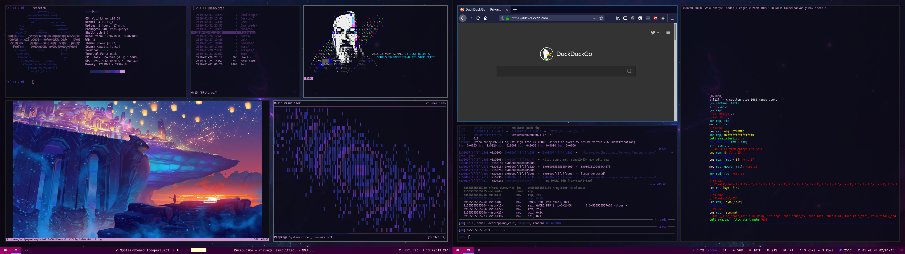

# DotFiles

I used pywal for urxvt and sometimes in as my vim colorscheme
Letme know if something doesnt work

# Rofi
I do not recall where i got the config file from (please let me know if you have seen this before), but i changed that config to be fullscreen.

# compton
i did not touch the config files for this.

# URxvt
Like i said i used pywal to generate a colorscheme for it

## Neovim
This should work out of the box, but in some cases it can give you a warning if it does, you want to install Ultisnips with python

## i3-gaps
You may want to take out some of the media keys that i've added (i only use alsa commands btw).
also i have a calc instance running when it starts up to do math stuff change it if you want to run some other calculator app
#### Scripts
* waller.sh -> This is a wallpaper changing script i wrote, read the info i've given in that file to learn more

## polybar
### NOTE: This was for a double monitor setup you may want to change it to adopt to a single or even triple monitor setup
i stole the font combination from: https://github.com/adi1090x/polybar-themes
MaterialIcon font and Fantasque Sans. If you are downloading the Material font you may have some issue because of the version numbers
these fonts change drastically from one version to the other, If you want it to work perfectly i've uploaded the exact ttf i used.
#### Scripts
* I have a script for calcurse running which shows it in the second monitor
* I got the weather checking script from https://github.com/x70b1/polybar-scripts I changed it so that i dont need to download all their extra fonts
* Also you may want to get their API key to use it https://openweathermap.org/appid
